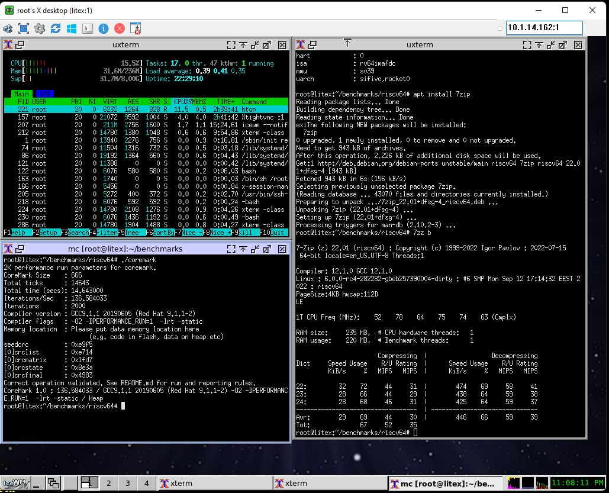

# Running RISCV64 Debian on Litex/Rocket with a qmtech wukong FPGA

Inspired from https://github.com/tongchen126/Boot-Debian-On-Litex-Rocket 

I managed to run a -pretty much- stable RISCV64 Debian with Qmtech's Wukong board (version 2) and Litex/Rocket.
As a development environment I used Debian Buster. The steps I followed are (beware, YMMV) :

1) I Installed Linux on Litex Rocket (https://github.com/litex-hub/linux-on-litex-rocket) and followed the steps 1-4 in "Prerequisites" to install litex.
NOTE DO NOT SKIP step 3 if you do not have an already proved toolchain. Debian's toolchain also gave me a lot of headaches. It takes some time to build it but you will not regret it ! 

2) At "Building the Gateware (FPGA Bitstream) -> NOTE 1", I do not really know what is the bit width of the point-to-point AXI link connecting the CPU and LiteDRAM controller. 
I'm not getting either "INFO:SoC:Matching AXI MEM data width (XXX)" or "INFO:SoC:Converting MEM data width: XXX to YYY via Wishbone" lines in the output, as the instructions say. 
I guessed that I have 128 bits based on the DRAM chip (MT41K128M16) that is the same as with digilent arty. Also tongchen126 mentioned linux4d and full2d. 

UPDATE: follwing this advice from Gabriel, https://github.com/litex-hub/linux-on-litex-rocket/issues/10#issuecomment-1249245531, indeed, the bit width is 128 

3) I configured litex to include all the cpu variants that I needed and were missing, eg linux4d or full2d

```
      cd pythondata-cpu-rocket/pythondata_cpu_rocket/verilog
      vi update.sh   copy-paste and change accordingly, adding the variant you need
      ./update.sh (will take some time)
      vi litex/litex/soc/cores/cpu/rocket/core.py  add accordingly the variant you need
```
4) I use Vivado. In "Building the Gateware (FPGA Bitstream)" I tried two cases: linux4d (4 cores without FPU) and fulld (1 core with FPU). 
For some reason I'm not able to synthesize a full2d cpu, as tongchen126 mentioned, requires 67221 SLUTS, I have only 63400.

	NOTE 1 : I found that adding bigger L2 cache improves the stability of the SOC. I used 2M, which may be a bit overkill :) 

	NOTE 2 : Using a medium cpu with FPU support from BBL (linux or linux4d) seems pretty slow and unstable. The single core with FPU (fulld) is faster and pretty stable. 

	NOTE 3 : The clock frequency I used is 100MHz, a lot better that my initial tests with 50MHz. 

	NOTE 4 : Special attention, which board version you have, mine is version 2.

I included ethernet, video terminal and an sdcard.  The commands that I used were :
```
  litex-boards/litex_boards/targets/qmtech_wukong.py --build --with-ethernet  --with-sdcard --with-video-terminal  \
      --cpu-type rocket  --cpu-variant linux4d  --l2-size 2097152 --sys-clk-freq 100e6  --board-version 2
```
  and
```  
  litex-boards/litex_boards/targets/qmtech_wukong.py --build --with-ethernet  --with-sdcard --with-video-terminal  \
      --cpu-type rocket  --cpu-variant fulld  --l2-size 2097152 --sys-clk-freq 100e6  --board-version 2
```

5) I used the dts files for nexys4ddr.dts and nexys4ddr_fpu.dts as prototypes to make the corresponding files for the board. 
The main difference is the 256MB (vs 128MB) DRAM chip. Also I modified the linux command line to make booting easier.

6) I boot without an initrd, directly from the SDcard. I have 3 partitions:  sda1 (mmcblck0p1) with VFAT for booting (where boot.bin is placed), sda2 (mmcblck0p2) as a 8GB swap, and sda3 (mmcblck0p3) as ext4 root filesystem.

7) In "Building the Software", skip steps 1 and 2 (building of busybox and initramfs.cpio). Will boot straight with Debian's systemd on the sdcard. BTW, if IF you ever need busybox, the staticaly linked provided by Debian works fine.

8) In step 3 (Building the Kernel), use the first make without initramfs.config:
```
		make ARCH=riscv CROSS_COMPILE=riscv64-unknown-linux-gnu- \
			litex_rocket_defconfig litex_rocket
```

and after edit the resulting .config , search for CONFIG_RISCV_SBI_V01 and change it to 
```
	CONFIG_RISCV_SBI_V01=yes
```

before you compile the kernel.

9) Build BBL with the correct DTS file. Copy the resulting boot.bin in the first (VFAT) partition of the SDcard

10) Created a chroot Debian environment with the instructions from https://wiki.debian.org/RISC-V, step 6, "Creating a riscv64 chroot", with debootstrap. 
```
	sudo apt-get install debootstrap qemu-user-static binfmt-support debian-ports-archive-keyring
	sudo debootstrap --arch=riscv64 --keyring /usr/share/keyrings/debian-ports-archive-keyring.gpg --include=debian-ports-archive-keyring unstable /tmp/riscv64-chroot http://deb.debian.org/debian-ports
```

and run after the steps in "Preparing the chroot for use in a virtual machine". The steps for u-boot are not really needed (for the moment at least). I modified a few other things in the chroot environment, eg  installed udev, locales / timezone (as mentioned from tongchen126), changed the systemd default target to multiuser, eliminated the targets that where not absolutely necessary, canceled agetty's to the console ttys and a few others. 

In my case, systemd worked better that sysvinit. At least with fulld, I'm not even getting the RCU warnings. If needed, they can be disabled from kernel's boot arguments with 
```
      rcupdate.rcu_cpu_stall_suppress=1
```   
In systemd's journald.conf, I used:
```
	Storage=none
```

and in logind.conf:
```
	NAutoVTs=1
	ReserveVT=1
```

and in /etc/login.defs :
```
	LOGIN_TIMEOUT           180
```

After all, this is a very low resources board and it is SLOW! 

      
A few additional things needed to be edited, eg hostname, hosts, network/interfaces, fstab etc. Also pay attention to the kernel boot arguments I used in the DTS. The "rescue" option is very helpfull in order to get an early login into the system if the multiuser environment is not stable.

Copy your chroot environment to sda3 (mmcblk0p3), put the card in the board, program the bitstream and you are ready to boot to Debian !

Note: I found that the FPGA was too unstable after a while, and had arbitrary crashes in unpredictable stages. It seems that the situation has been improved after I used a small heatsink. Also placing the board inside the computer room (stable 18 Celsious) helped a lot ;)

I have it now running with fulld, vncserver + icewm, almost a day and it is ok




Next steps: 
Figure out how to use opensbi+u-boot instead of BBL for more flexible boot.


 

	
	
		
		
		
		


